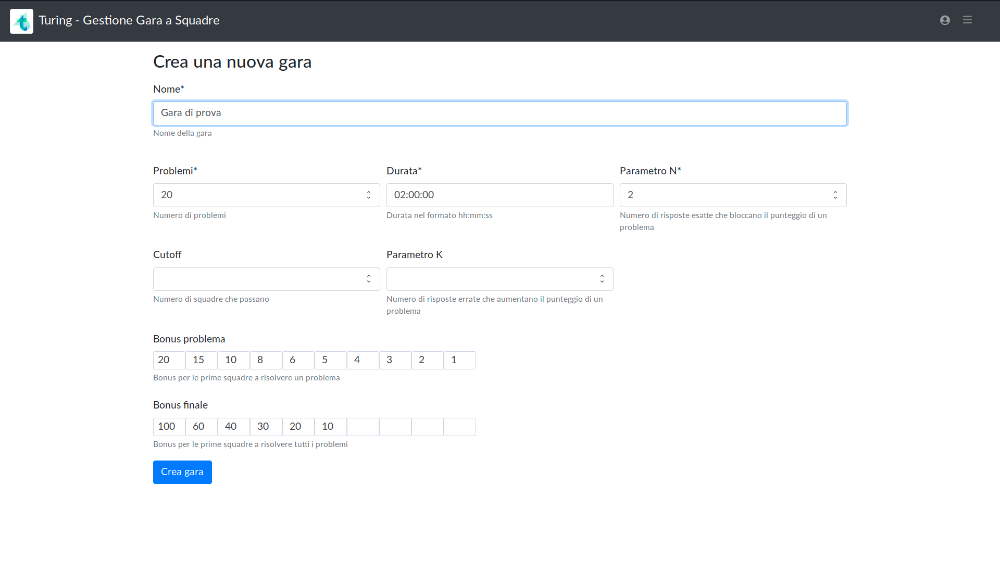
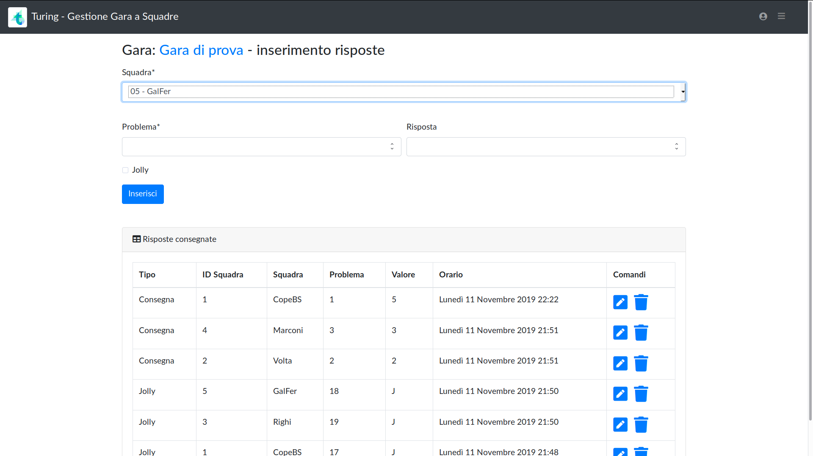
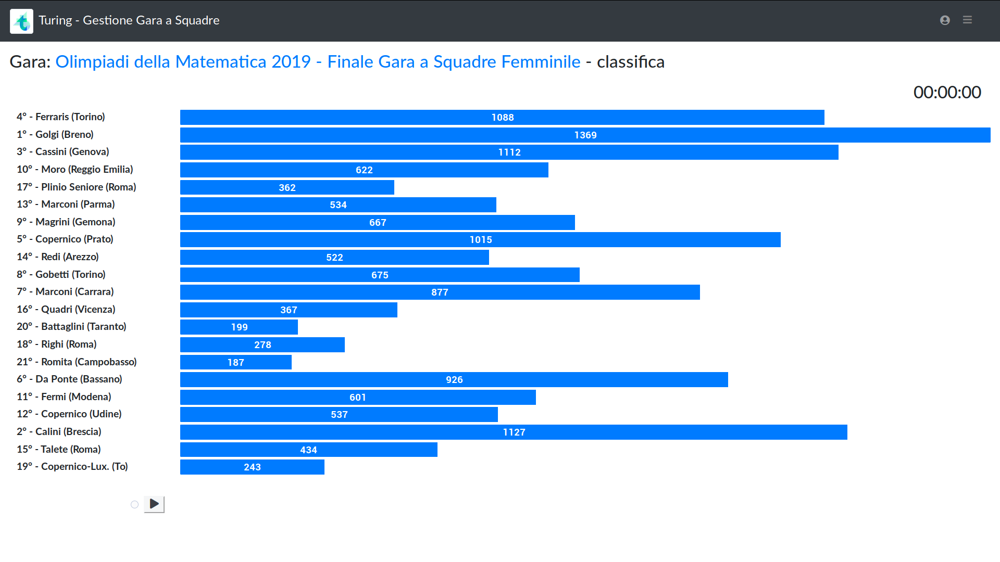
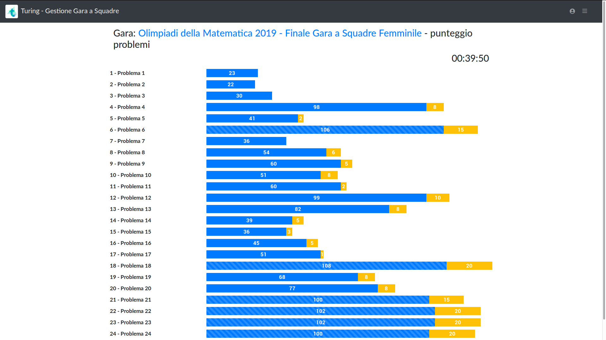
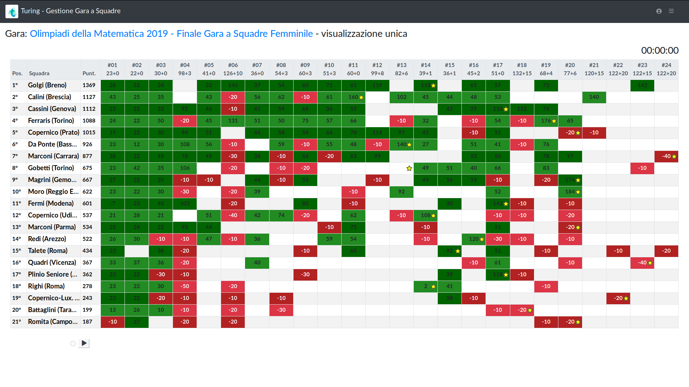
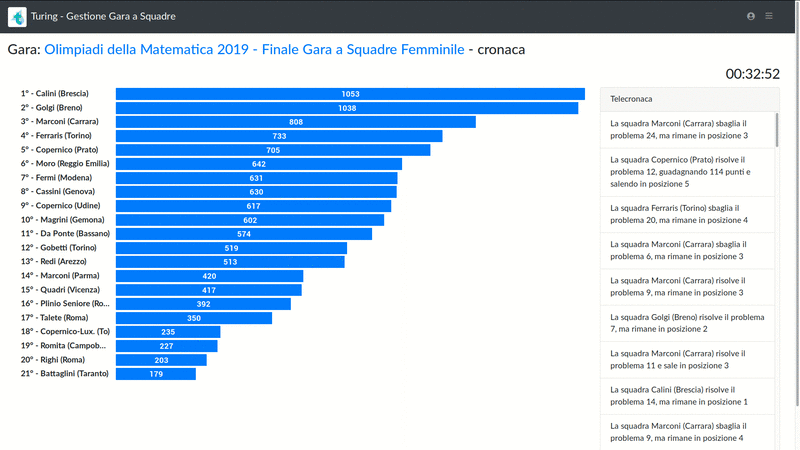

# Turing

<h1 align="center">
  
</h1>
<h3 align="center">Gestore di Gare a Squadre</h3>

Turing è un programma open source per la gestione di gare a squadre sul modello di quelle organizzate dal gruppo [Olimpiadi della Matematica](http://olimpiadi.dm.unibo.it/le-gare/gara-a-squadre/).

Può essere usato in locale senza bisogno di un collegamento internet. È scritto in Python, quindi può essere fatto girare su qualunque sistema operativo.

Disclaimer: il software al momento è in versione alpha, quindi con funzionalità molto ridotte e una certa probabilità di bug.

# Utilizzo e screenshot

Dalla home del sito è posibile creare una nuova gara, impostando tutti i parametri necessari.

Si può poi procedere all'inserimento delle risposte; è anche possibile modificare ed eliminare gli inserimenti.

Infine ci sono le schermate di visualizzazione della classifica: visualizzazione classica delle squadre,

visualizzazione classica dei punteggi dei problemi.

Visualizzazione unificata: stato dei problemi, punteggi e classifica.

C'è poi una visualizzazione in tempo reale e in replay della classifica ordinata, con gli eventi più importanti descritti a fianco.

# Installazione

È necessario avere Python3 installato.
Per Windows, scaricate un installer da [qua](https://www.python.org/downloads/windows/) o dallo Store di Microsoft.

Basta scaricare la release di Turing, unzipparla e lanciare lo script `setup` (.bat se siete su Windows, .sh se siete su Linux).

Questo installerà le dipendenze necessarie e farà partire il server. A questo punto basterà accedere da un browser all'indirizzo (http://localhost:8000), e effettuare login con utente `admin` e password `admin` per creare una gara.

Anche per gli avvii successivi è sufficiente eseguire lo script.

**Attenzione**: l'installazione creata in questo modo tramite `setup` è da considerarsi un'installazione di prova assolutamente insicura (come probabilmente avete intuito dalla password scritta qui sopra).
Potete usarla per gare di allenamento, ma sconsigliamo di usarla per gare più importanti in cui c'è qualcosa in palio.

## Per i più smanettoni

Con le seguenti istruzioni potete installare una copia del codice sorgente di Turing per scrivere codice e contribuire al suo sviluppo.

Le seguenti istruzioni creano una cartella `turing` nella cartella corrente, vi installano il codice sorgente, e preparano tutto per partire.

    git clone git@gitlab.com:drago-96/turing.git
    cd turing
    virtualenv -p python3 virtualenv
    cp Turing/settings.py Turing/settings-dev.py
    echo -e '\nDEBUG = True' >> Turing/settings-dev.py

Dopodiché, sia per questa prima installazione che tutte le volte che vorrete lavorare sul codice sorgente o eseguire la vostra versione di Turing dovrete prima di tutto dare questi due comandi all'interno della vostra shell.

    . virtualenv/bin/activate
    export DJANGO_SETTINGS_MODULE=Turing.settings

Sotto Windows la prima riga, quella che comincia con `.`, va rimpiazzata con

    virtualenv\bin\activate.bat

Dopo aver dato questi comandi, potete completare la vostra prima installazione così:

    pip install -r requirements-dev.txt
    python manage.py makemigrations
    python manage.py makemigrations engine
    python manage.py migrate

Poi, per far partire il server (dopo aver dato i due comandi di attivazione di cui sopra):

    python manage.py runserver

Se volete creare un superutente:

    python manage.py createsuperuser

# Contribuire

Abbiamo deciso di creare questo software open source nella speranza che tutta la comunità delle Olimpiadi possa unire gli sforzi per creare un gestore di gare a squadre bellissimo e che soddisfi tutte le esigenze.

Perciò per qualunque osservazione siete invitati ad aprire issues su questo repository, in particolare per

* Segnalare bug e malfunzionamenti
* Proporre nuove funzionalità
* Suggerire modifiche all'interfaccia
* Aggiungere parametri di gara

Infine, se volete contribuire al codice siete i benvenuti! Forkate e proponete le vostre magnifiche pull requests!

# Features progettate

 - [ ] autoinserimento da parte delle singole squadre
 - [ ] possibilità di importare una gara passata e parteciparvi virtualmente

# Chi siamo

Il team di sviluppatori è composto da Riccardo Zanotto, Matteo Migliorini, Federico Poloni, Matteo Protopapa, Matteo Rossi.

# Licenza

Questo software è distribuito sotto la licenza GNU AGPL v3, vedere il file [LICENSE](LICENSE).
